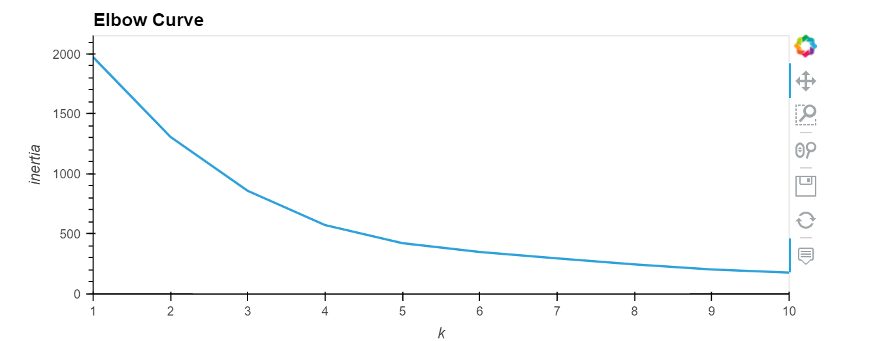
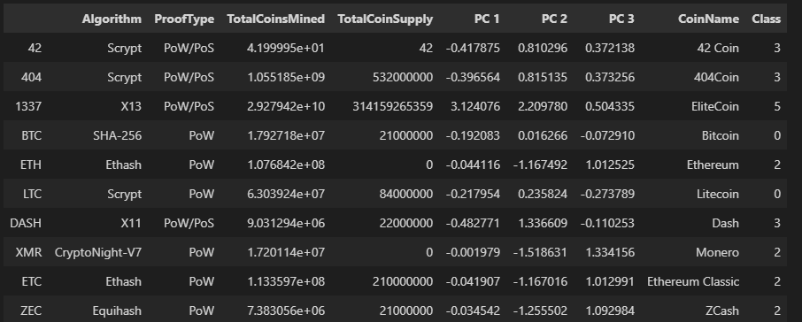
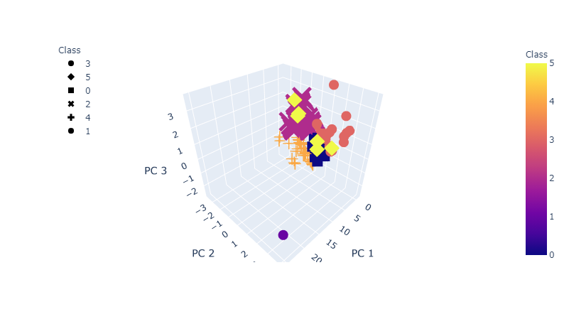
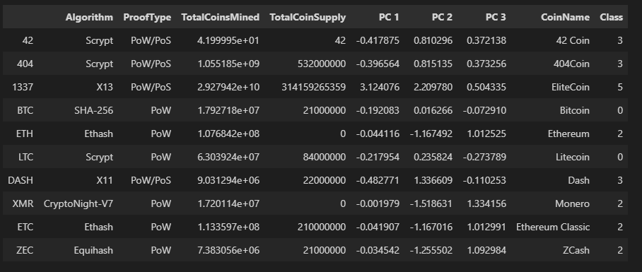
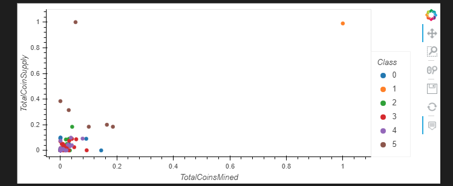
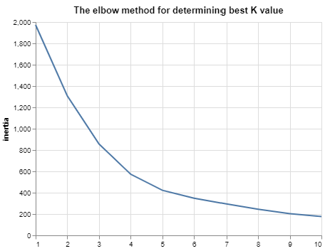
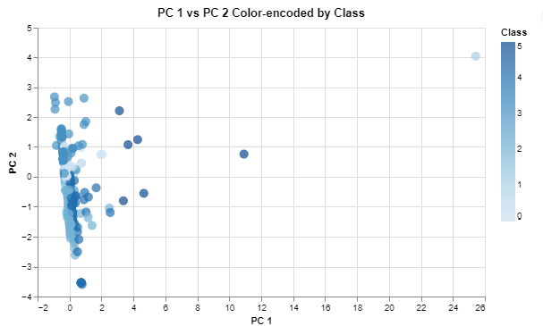
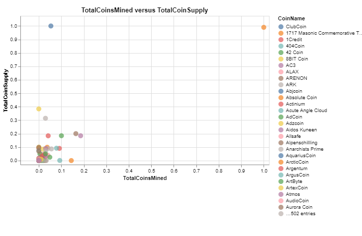
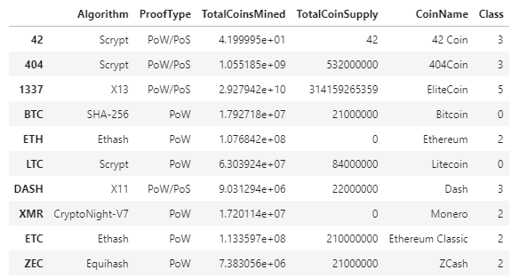

# Unit 13 Homework Assignment by John Mangahas

## The Power of the Cloud and Unsupervised Learning

## Background

It is time to take what I have learned about unsupervised learning and the AWS services and apply it to new situations. For this assignment, I will complete the Clustering Crypto challenge. 

### Process and workflow

1. Created a new repository for this project called `unit13-challenge`.

2. Cloned the new repository to local computer.

3. Created a directory for the challenge assignment **ClusteringCrypto**.

4. Added solution files to the folder.

5. Pushed the above changes to GitHub or GitLab.


## Clustering Crypto

### Background

I am a Senior Manager at the Advisory Services team on a [Big Four firm](https://en.wikipedia.org/wiki/Big_Four_accounting_firms). One of my most important clients, a prominent investment bank, is interested in offering a new cryptocurrencies investment portfolio for its customers, however, they are lost in the immense universe of cryptocurrencies. They ask me to help them make sense of it all by generating a report of what cryptocurrencies are available on the trading market and how they can be grouped using classification.  

In this homework assignment, I will service my new unsupervivsed learning and Amazon SageMaker skills into action by clustering cryptocurrencies and creating plots to present your results.

Accomplished the following main tasks:

* **[Data Preprocessing](#Data-Preprocessing):** Prepared data for dimension reduction with PCA and clustering using K-Means.

* **[Reducing Data Dimensions Using PCA](#Reducing-Data-Dimensions-Using-PCA):** Reduced data dimension using the `PCA` algorithm from `sklearn`.

* **[Clustering Cryptocurrencies Using K-Means](#Clustering-Cryptocurrencies-Using-K-Means):** Predicted clusters using the cryptocurrencies data using the `KMeans` algorithm from `sklearn`.

* **[Visualizing Results](#Visualizing-Results):** Created plots and data tables to present results.

* **[Optional Challenge](#Optional-Challenge):** Deployed notebook to Amazon SageMaker.

---

### Files

* [crypto_clustering.ipynb](ClusteringCrypto/crypto_clustering.ipynb)

* [cyprto_clustering_sm.ipynb](ClusteringCrypto/crypto_clustering_sm.ipynb)

---

### Instructions

#### Data Preprocessing

Loaded the information about cryptocurrencies and perform data preprocessing tasks.  

1. Used the provided `CSV` file, created a `Path` object and read the file data directly into a DataFrame named `crypto_df` using `pd.read_csv()`.

2. Used the following `requests` library, retreived the necessary data from the following API endpoint from _CryptoCompare_ - `https://min-api.cryptocompare.com/data/all/coinlist`.  

After succesffully loading the data into a Pandas DataFrame, continued with the following data preprocessing tasks.

3. Kept only the necessary columns: 'CoinName','Algorithm','IsTrading','ProofType','TotalCoinsMined','TotalCoinSupply'

4. Kept only the cryptocurrencies that are trading.

5. Kept only the cryptocurrencies with a working algorithm.

6. Removed the `IsTrading` column.

7. Removed all cryptocurrencies with at least one null value.

8. Removed all cryptocurrencies that have no coins mined.

9. Dropped all rows where there are 'N/A' text values.

10. Stored the names of all cryptocurrencies in a DataFrame named `coins_name`, use the `crypto_df.index` as the index for this new DataFrame.

11. Removed the `CoinName` column.

12. Created dummy variables for all the text features, and store the resulting data in a DataFrame named `X`.

13. Used the [`StandardScaler` from `sklearn`](https://scikit-learn.org/stable/modules/generated/sklearn.preprocessing.StandardScaler.html) to standardize all the data of the `X` DataFrame.

#### Reducing Data Dimensions Using PCA

Used the [`PCA` algorithm from `sklearn`](https://scikit-learn.org/stable/modules/generated/sklearn.decomposition.PCA.html) to reduce the dimensions of the `X` DataFrame down to three principal components.

After reducing the data dimensions, created a DataFrame named `pcs_df` using as columns names `"PC 1", "PC 2"` and `"PC 3"`;  use the `crypto_df.index` as the index for this new DataFrame.

#### Clustering Cryptocurrencies Using K-Means

Used the [`KMeans` algorithm from `sklearn`](https://scikit-learn.org/stable/modules/generated/sklearn.cluster.KMeans.html) to cluster the cryptocurrencies using the PCA data.

Performed the following tasks:

1. Created an Elbow Curve to find the best value for `k` using the `pcs_df` DataFrame.



2. Defined the best value for `k`, run the `Kmeans` algorithm to predict the `k` clusters for the cryptocurrencies data. Use the `pcs_df` to run the `KMeans` algorithm.

3. Created a new DataFrame named `clustered_df`, that includes the following columns `"Algorithm", "ProofType", "TotalCoinsMined", "TotalCoinSupply", "PC 1", "PC 2", "PC 3", "CoinName", "Class"`. Maintained the index of the `crypto_df` DataFrames as is shown bellow.

Result:



#### Visualizing Results

Created some data visualization to present the final results. Perform the following tasks:

1. Created a 3D-Scatter using Plotly Express to plot the clusters using the `clustered_df` DataFrame. included the following parameters on the plot: `hover_name="CoinName"` and `hover_data=["Algorithm"]` to show this additional info on each data point.



2. Used `hvplot.table` to create a data table with all the current tradable cryptocurrencies. The table should have the following columns: `"CoinName", "Algorithm", "ProofType", "TotalCoinSupply", "TotalCoinsMined", "Class"`




3. Created a scatter plot using `hvplot.scatter`, to present the clustered data about cryptocurrencies having `x="TotalCoinsMined"` and `y="TotalCoinSupply"` to contrast the number of available coins versus the total number of mined coins. Use the `hover_cols=["CoinName"]` parameter to included the cryptocurrency name on each data point.

Result:




### Optional Challenge

For the challenge section, I uploaded the Jupyter notebook to Amazon SageMaker and deployed it.

The `hvplot` and Plotly Express libraries are not included in the built-in anaconda environments, so for this challenge section, I used the `altair` library instead.

Performed the following tasks:

1. Uploaded Jupyter notebook and rename it as `crypto_clustering_sm.ipynb`

2. Selected the `conda_python3` environment.

3. Installed the `altair` library by running the following code before the initial imports.

  ```python
  !pip install -U altair
  ```

4. Used the `altair` scatter plot to create the Elbow Curve.

Result:



5. Used the `altair` scatter plot, instead of the 3D-Scatter from Plotly Express, to visualize the clusters. Since this is a 2D-Scatter, use `x="PC 1"` and `y="PC 2"` for the axes, and add the following columns as tool tips: `"CoinName", "Algorithm", "TotalCoinsMined", "TotalCoinSupply"`.

Result:



6. Used the `altair` scatter plot to visualize the tradable cryptocurrencies using  `x="TotalCoinsMined"` and `y="TotalCoinSupply"` for the axes.

Result:



7. Show the table of current tradable cryptocurrencies using the `display()` command.

Result:



